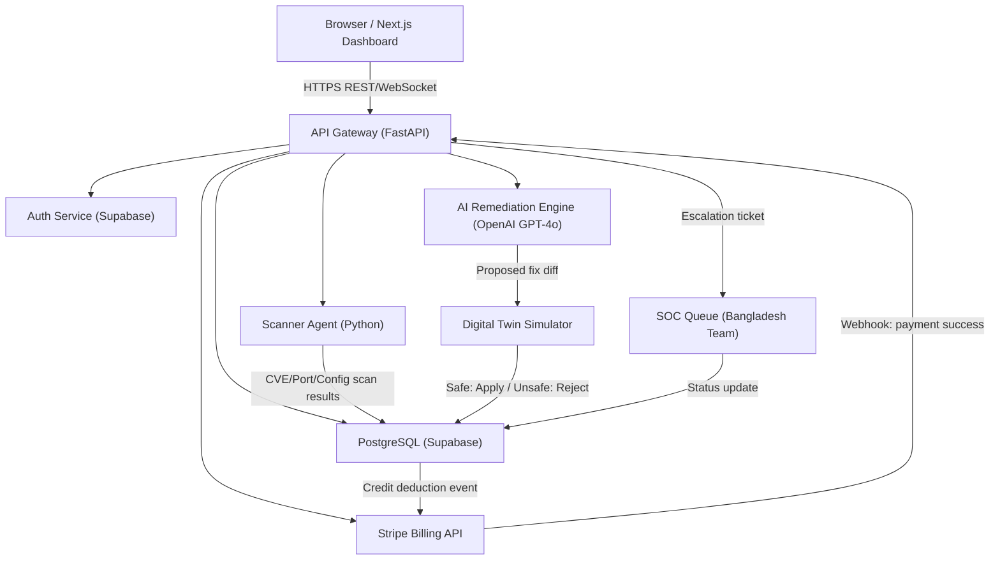
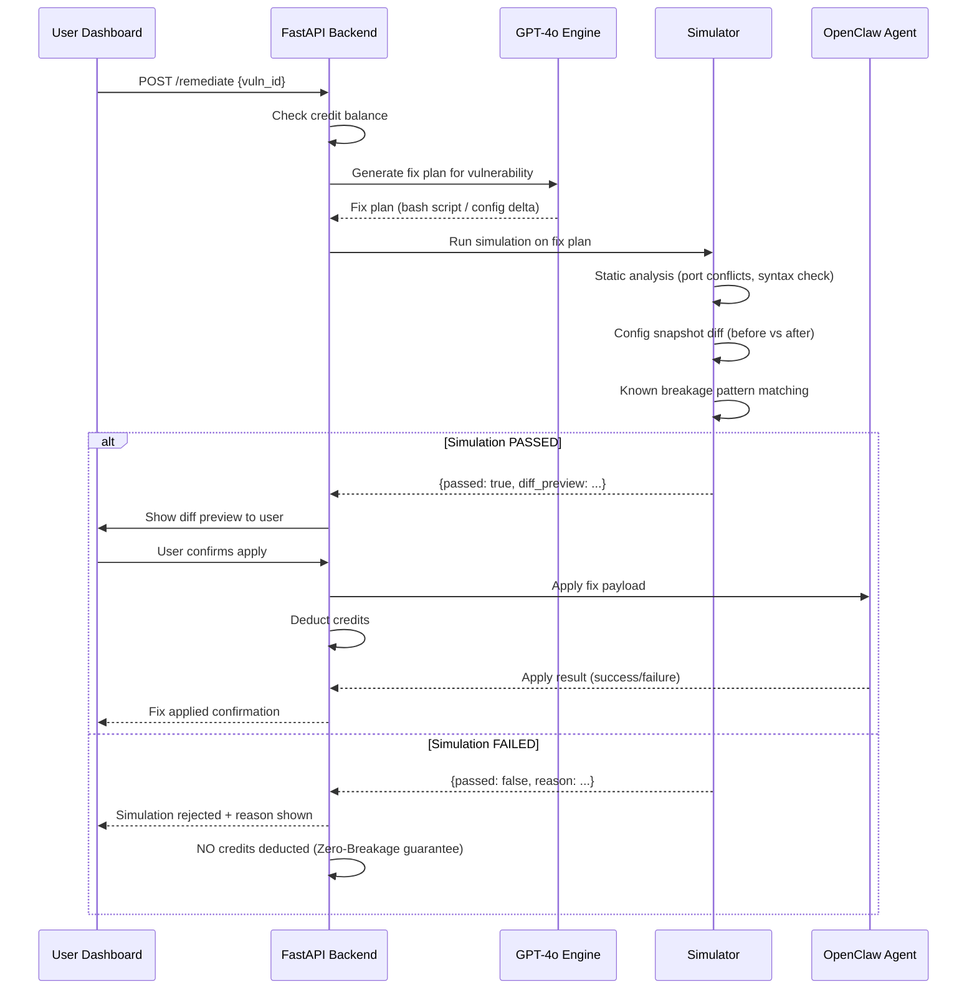

# AI Cybersecurity Remediation Platform — Implementation Plan

> **Product Name:** OpenClaw Sentinel SaaS (working title)
> **Business Model:** Product-Led Growth (PLG) | Free Scanner → AI Credit Subscriptions → Human SOC Escalation

---

## Executive Summary

This document defines the full system architecture, tech stack, database schema, and phased build plan for the Zero-Breakage AI Cyber Remediation Platform — a B2B SaaS product built on top of the existing OpenClaw Sentinel engine.

---

## User Review Required

> [!IMPORTANT]
> **Decision: Marketing Site Location**
> The landing page will be built as a **new subfolder** inside the existing workspace: `d:\Antigravity Project\marketing-site\` as a standalone Next.js app. This keeps it separate from the core OpenClaw Python agent. **Please confirm this is acceptable**, or if you want it in a completely separate repo.

> [!IMPORTANT]
> **Decision: Backend Language**
> The plan recommends **Python (FastAPI)** for the SaaS backend, which reuses your team's existing Python expertise from the OpenClaw Sentinel engine. An alternative is **Go (Fiber)** for ~10x higher concurrency at scale. Since this is an MVP, FastAPI is the recommended starting point. **Please confirm or override.**

> [!WARNING]
> **Stripe Integration**
> Stripe's live keys must be provisioned by you. The implementation plan will use placeholder environment variables (`STRIPE_SECRET_KEY`, `STRIPE_WEBHOOK_SECRET`). Webhook endpoint registration with Stripe's dashboard will need to be completed manually after deployment.

> [!CAUTION]
> **Zero-Breakage Simulation Engine**
> The Digital Twin simulation (Phase 3) requires provisioning of a cloud sandbox environment (e.g., a GCP or AWS micro-VM per client tenant) to stage fixes. This has cloud cost implications. The MVP will implement a **mocked simulation layer** that performs static analysis and diff previews before applying any changes — a full sandbox VM approach is marked as Phase 3+.

---

## System Architecture Overview



---

## Data Flow: Detailed

### Flow 1 — Free Scan
1. User signs up (email/Google via Supabase Auth)
2. User installs the **OpenClaw Scanner Agent** (lightweight Python daemon) on their server/cloud host
3. Agent runs: port scan, CVE lookup, firewall state, open socket audit, SSL cert check
4. Results POST'd to `POST /api/v1/scans` with JWT auth
5. AI engine generates a plain-English **Vulnerability Report** (stored in `vulnerability_reports` table)
6. Report rendered in the Next.js dashboard — **100% free, no credits consumed**

### Flow 2 — AI Auto-Fix (Credits)
1. User selects a vulnerability from their report and clicks **"Auto-Fix with AI"**
2. Frontend calls `POST /api/v1/remediate` with `{scan_id, vuln_id}`
3. API checks `users.credit_balance >= 1` (1 credit = 1 standard fix)
4. GPT-4o generates a remediation plan (bash script / config patch / firewall rule delta)
5. **Zero-Breakage Simulator** runs the diff against a snapshot of the client's config (Phase 1: static analysis; Phase 3+: live VM sandbox)
6. If simulation passes → fix applied to the agent, credit deducted
7. If simulation fails → rejected with explanation, **no credit deducted**

### Flow 3 — Human SOC Escalation (50 Credits)
1. User clicks **"Escalate to SOC Team"** on a complex vulnerability
2. API validates 50-credit balance → deducts → creates a ticket in `soc_escalations` table
3. Email notification fires to Bangladesh SOC team queue (via SendGrid)
4. SOC team logs resolution in the `soc_escalations.resolution_notes` field
5. Client receives email notification + dashboard update when resolved

### Flow 4 — Credit Purchase (Stripe)
1. User selects a credit tier on the Pricing page
2. Frontend calls `POST /api/v1/billing/checkout` → creates Stripe Checkout Session
3. User completes payment on Stripe's hosted page
4. Stripe fires `checkout.session.completed` webhook to `POST /api/v1/billing/webhook`
5. API validates webhook signature → updates `users.credit_balance`

---

## Tech Stack Recommendations

| Layer | Technology | Rationale |
|---|---|---|
| **Frontend** | Next.js 14 (App Router) + Tailwind CSS | SEO-friendly, fast, industry standard for SaaS |
| **Animations** | Framer Motion | Smooth, production-grade micro-animations |
| **Icons** | Lucide React | Lightweight, consistent icon set |
| **Backend API** | Python FastAPI | Reuses existing OpenClaw Python expertise; async-native, fast |
| **Auth** | Supabase Auth | Free tier, drop-in JWT auth w/ Google OAuth |
| **Database** | PostgreSQL via Supabase | Managed, free tier, built-in Row Level Security |
| **AI Engine** | OpenAI GPT-4o API | Best reasoning for security context + code generation |
| **Scanner Agent** | Python (existing OpenClaw codebase) | Extend `app.py` with a cloud-report-upload mode |
| **Billing** | Stripe | Industry standard; webhooks for credit top-ups |
| **Email** | SendGrid | SOC escalation alerts + user notifications |
| **Deployment** | Vercel (frontend) + Google Cloud Run (API) | Zero-config, auto-scaling, free tiers |
| **CI/CD** | GitHub Actions | Automated test + deploy on push |

---

## Database Schema (PostgreSQL)

### `users`
```sql
CREATE TABLE users (
    id              UUID PRIMARY KEY DEFAULT gen_random_uuid(),
    supabase_uid    UUID UNIQUE NOT NULL,       -- Links to Supabase Auth
    email           TEXT UNIQUE NOT NULL,
    full_name       TEXT,
    company_name    TEXT,
    credit_balance  INTEGER NOT NULL DEFAULT 0,
    stripe_customer_id TEXT,
    plan_tier       TEXT DEFAULT 'free',        -- 'free' | 'starter' | 'pro' | 'enterprise'
    created_at      TIMESTAMPTZ DEFAULT NOW(),
    updated_at      TIMESTAMPTZ DEFAULT NOW()
);
```

### `scan_sessions`
```sql
CREATE TABLE scan_sessions (
    id              UUID PRIMARY KEY DEFAULT gen_random_uuid(),
    user_id         UUID REFERENCES users(id) ON DELETE CASCADE,
    target_host     TEXT NOT NULL,              -- IP or hostname scanned
    agent_version   TEXT,
    status          TEXT DEFAULT 'pending',     -- 'pending' | 'running' | 'complete' | 'failed'
    scan_type       TEXT DEFAULT 'full',        -- 'full' | 'quick' | 'network_only' | 'web'
    raw_results     JSONB,                      -- Raw nmap/psutil/CVE dump
    started_at      TIMESTAMPTZ DEFAULT NOW(),
    completed_at    TIMESTAMPTZ
);
```

### `vulnerability_reports`
```sql
CREATE TABLE vulnerability_reports (
    id              UUID PRIMARY KEY DEFAULT gen_random_uuid(),
    scan_id         UUID REFERENCES scan_sessions(id) ON DELETE CASCADE,
    user_id         UUID REFERENCES users(id) ON DELETE CASCADE,
    severity        TEXT NOT NULL,              -- 'critical' | 'high' | 'medium' | 'low' | 'info'
    category        TEXT NOT NULL,              -- 'open_port' | 'outdated_software' | 'misconfig' | 'ssl_issue' | 'cve'
    title           TEXT NOT NULL,              -- e.g., "Telnet (Port 23) is Exposed to Internet"
    plain_english   TEXT NOT NULL,              -- AI-generated plain-English explanation
    technical_detail JSONB,                     -- Raw technical data
    remediation_status TEXT DEFAULT 'open',     -- 'open' | 'in_progress' | 'fixed' | 'wont_fix' | 'escalated'
    cve_ids         TEXT[],                     -- e.g., ['CVE-2024-1234']
    credit_cost     INTEGER DEFAULT 1,          -- Credits needed to auto-fix (50 for SOC)
    created_at      TIMESTAMPTZ DEFAULT NOW()
);
```

### `remediation_jobs`
```sql
CREATE TABLE remediation_jobs (
    id              UUID PRIMARY KEY DEFAULT gen_random_uuid(),
    vuln_id         UUID REFERENCES vulnerability_reports(id) ON DELETE CASCADE,
    user_id         UUID REFERENCES users(id) ON DELETE CASCADE,
    job_type        TEXT NOT NULL,              -- 'ai_auto_fix' | 'soc_escalation'
    status          TEXT DEFAULT 'queued',      -- 'queued' | 'simulating' | 'approved' | 'applying' | 'done' | 'failed' | 'rejected_by_sim'
    ai_fix_plan     TEXT,                       -- GPT-4o generated fix instructions
    simulation_result JSONB,                    -- Digital Twin sim output
    simulation_passed BOOLEAN,
    credits_debited INTEGER DEFAULT 0,
    applied_at      TIMESTAMPTZ,
    error_message   TEXT,
    created_at      TIMESTAMPTZ DEFAULT NOW()
);
```

### `soc_escalations`
```sql
CREATE TABLE soc_escalations (
    id              UUID PRIMARY KEY DEFAULT gen_random_uuid(),
    remediation_job_id UUID REFERENCES remediation_jobs(id),
    user_id         UUID REFERENCES users(id) ON DELETE CASCADE,
    vuln_id         UUID REFERENCES vulnerability_reports(id),
    priority        TEXT DEFAULT 'normal',      -- 'normal' | 'urgent' | 'critical'
    status          TEXT DEFAULT 'open',        -- 'open' | 'in_progress' | 'resolved' | 'closed'
    assigned_to     TEXT,                       -- SOC analyst name
    client_notes    TEXT,
    resolution_notes TEXT,
    sla_deadline    TIMESTAMPTZ,
    resolved_at     TIMESTAMPTZ,
    created_at      TIMESTAMPTZ DEFAULT NOW()
);
```

### `credit_transactions`
```sql
CREATE TABLE credit_transactions (
    id              UUID PRIMARY KEY DEFAULT gen_random_uuid(),
    user_id         UUID REFERENCES users(id) ON DELETE CASCADE,
    amount          INTEGER NOT NULL,           -- Positive = purchase, Negative = spend
    balance_after   INTEGER NOT NULL,
    transaction_type TEXT NOT NULL,             -- 'purchase' | 'ai_fix' | 'soc_escalation' | 'refund' | 'bonus'
    stripe_payment_intent TEXT,
    description     TEXT,
    created_at      TIMESTAMPTZ DEFAULT NOW()
);
```

### `credit_packages` (Stripe Products)
```sql
CREATE TABLE credit_packages (
    id              UUID PRIMARY KEY DEFAULT gen_random_uuid(),
    name            TEXT NOT NULL,              -- 'Starter', 'Pro', 'Enterprise'
    credits         INTEGER NOT NULL,
    price_usd_cents INTEGER NOT NULL,
    stripe_price_id TEXT UNIQUE NOT NULL,
    is_active       BOOLEAN DEFAULT TRUE,
    created_at      TIMESTAMPTZ DEFAULT NOW()
);
```

---

## Zero-Breakage Digital Twin Workflow



### Simulation Engine — MVP Implementation
The Phase 1 simulator is a **static analysis engine** (no live VM required):
1. **Syntax Validator** — Parses bash/config patches for syntax errors
2. **Port Conflict Detector** — Checks if the fix would block ports currently in use by critical services
3. **Firewall Rule Diff** — Visualizes exactly which rules are added/removed before applying
4. **Service Dependency Map** — Cross-references proposed changes against a known service dependency list
5. **Rollback Snapshot** — Before applying, the agent snapshots the current config state for instant rollback

**Phase 3+ (Full Digital Twin):**
- Provision an ephemeral GCP/AWS micro-VM from a snapshot of the client's environment
- Apply the fix in the sandbox
- Run automated health checks (service up? ports responding? CPU spike?)
- Only promote to production if all checks pass

---

## Proposed Changes (Phased Build)

### Phase 1 — Marketing Landing Page (Next.js)

#### [NEW] `d:\Antigravity Project\marketing-site\`
A complete Next.js 14 project with the following structure:

```
marketing-site/
├── app/
│   ├── layout.tsx          # Root layout, fonts, metadata
│   ├── page.tsx            # Landing page (assembles all sections)
│   └── globals.css         # Global Tailwind + custom CSS
├── components/
│   ├── Navbar.tsx          # Sticky glassmorphism nav
│   ├── HeroSection.tsx     # Headline, subheadline, CTA, animated background
│   ├── HowItWorks.tsx      # 3-step process (Scan → Report → Fix)
│   ├── ZeroBreakage.tsx    # Simulation guarantee highlight
│   ├── SOCBacking.tsx      # 24/7 human SOC team section
│   ├── PricingSection.tsx  # Credit tiers (visual cards)
│   ├── Footer.tsx          # Links, legal, social
│   └── ui/
│       └── AnimatedCard.tsx # Reusable Framer Motion card
├── public/
│   └── (generated assets)
├── next.config.js
├── tailwind.config.js
└── package.json
```

**Design Direction:**
- **Palette:** Deep space black `#050A14` background, electric cyan `#00D8FF` primary accent, violet `#8B5CF6` secondary
- **Typography:** Google Fonts "Inter" (body) + "Space Grotesk" (headings)
- **Effects:** Glassmorphism cards, animated mesh gradient hero, particle-like CSS starfield, neon glow borders
- **Animations:** Framer Motion scroll-triggered reveals, counter animations for stats, hover tilt effects on cards

### Phase 2 — Backend API Scaffold (FastAPI)

#### [NEW] `d:\Antigravity Project\api\`
```
api/
├── main.py                 # FastAPI app entrypoint
├── routers/
│   ├── auth.py             # Supabase JWT validation
│   ├── scans.py            # Scanner agent endpoints
│   ├── reports.py          # Vulnerability report CRUD
│   ├── remediate.py        # AI fix + simulation flow
│   ├── billing.py          # Stripe checkout + webhook
│   └── escalations.py      # SOC ticket management
├── models/
│   ├── db.py               # SQLAlchemy models
│   └── schemas.py          # Pydantic request/response schemas
├── services/
│   ├── ai_engine.py        # GPT-4o remediation generator
│   ├── simulator.py        # Digital Twin static analyzer
│   ├── stripe_service.py   # Stripe SDK wrapper
│   └── email_service.py    # SendGrid notifications
├── requirements.txt
└── Dockerfile
```

### Phase 3 — Extended OpenClaw Agent (Cloud Mode)
Extend the existing `app.py` with a `--cloud-report` flag that, instead of serving a local Flask UI, POSTs scan results to the SaaS API for cloud storage and remote dashboard viewing.

---

## Credit Tier Pricing (For Marketing Page)

| Tier | Credits | Price | Best For |
|---|---|---|---|
| **Starter** | 25 credits | $29/mo | Small teams, 25 AI fixes |
| **Pro** | 100 credits | $79/mo | Growing companies, includes 2 free SOC escalations |
| **Enterprise** | 500 credits | $299/mo | Large orgs, unlimited scanning, 10 free SOC escalations, SLA guarantee |
| **Pay-as-you-go** | 10 credits | $14 one-time | No commitment, try before subscribing |

> SOC Escalation = 50 credits | Standard AI Fix = 1 credit

---

## Open Questions

> [!IMPORTANT]
> **Q1: Company/Product Name for the Marketing Site**
> Should the landing page use "OpenClaw Sentinel" as the brand, or do you have a separate SaaS product name in mind? (e.g., "Sentinel AI", "ClawGuard", "ZeroBreak.io")

> [!IMPORTANT]
> **Q2: Domain & Deployment**
> Do you have a domain name for this platform? This affects meta tags, canonical URLs, and Vercel deployment config on the landing page.

> [!IMPORTANT]
> **Q3: Logo / Brand Assets**
> Should I generate a logo using the image generation tool, or do you have brand assets ready?

> [!IMPORTANT]
> **Q4: Phase Scope for This Session**
> Should I build **only the marketing landing page (Phase 1)** in this session, or do you also want the FastAPI backend scaffold (Phase 2) started simultaneously?

---

## Verification Plan

### Automated Tests
- `npm run build` — Ensure Next.js compiles with zero TypeScript errors
- `npm run dev` — Launch local dev server and verify all sections render
- Browser subagent screenshots of: desktop hero, mobile responsive view, pricing cards, CTA buttons

### Manual Verification
- Review browser screenshots of the full landing page
- Verify all section anchors (`#how-it-works`, `#pricing`, etc.) navigate correctly
- Confirm Framer Motion animations trigger on scroll
- Test mobile viewport (375px) responsiveness
